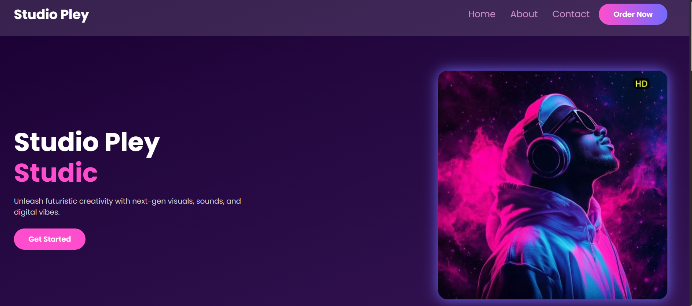
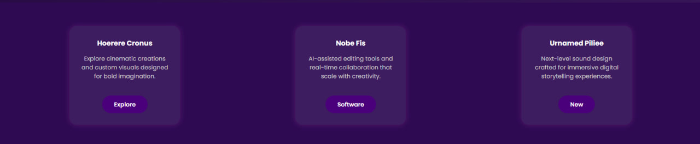
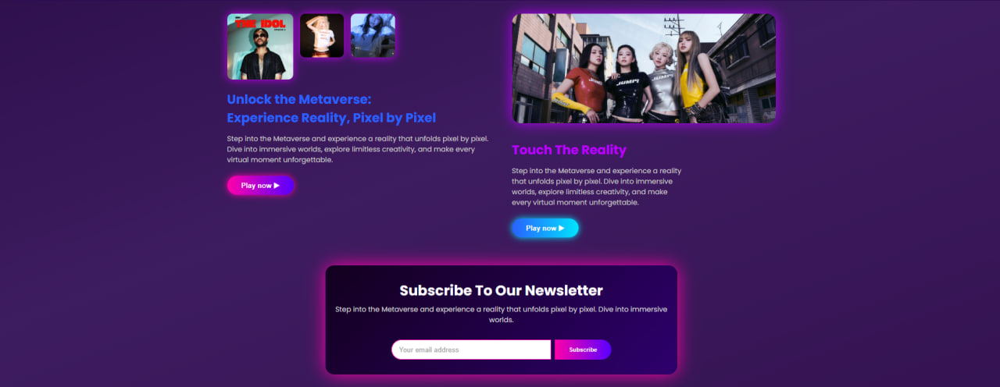
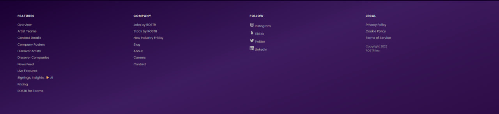
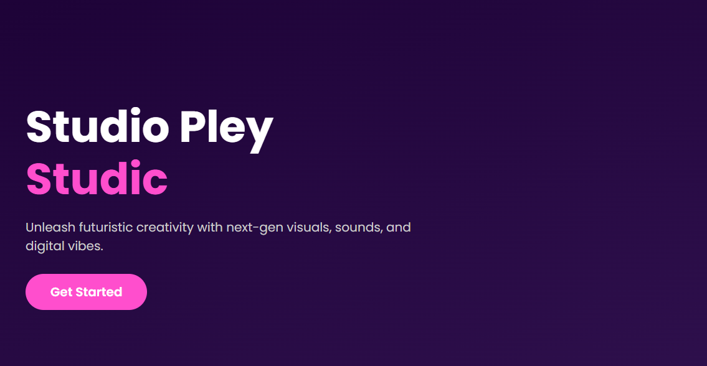

# Music band
## Home page
## 🎵 NoticeSound - Studio Pley

NoticeSound is a modern, responsive landing page built with **HTML** and **CSS**.  
It is designed for artists, music companies, and fans who want a robust platform for **managing tracks, discovering talent, and growing their fan base**.

---

## 🚀 Features

- **Navigation Bar**  
  Sticky header with smooth navigation links to Home, About, and Contact.

- **Hero Section**  
  Eye-catching intro with a background image, gradient overlay, glowing line animation, and a bold call-to-action.

- **Automatic Report Section**  
  Highlights NoticeSound’s research technology for analyzing tracks and market insights.

- **Fan-Base Growth Section**  
  Step-by-step guide with animations to upload, manage, and share music.

- **Responsive Design**  
  Works on desktop and mobile devices with optimized layout.

- **Footer Section**  
  Contains quick links for Features, Company, Legal, and social media icons.

---

#  About Page
- Home  
- About
- Contact

## In about page

- Hoerere Cronus
- Nobe Fis
- Urnamed Pilie

##  Information about music
### Unlock the metoverse:
### Experience Reality.Pixel by  Pixel
##### Music is the intentional arrangement of sounds and silences, combining elements like rhythm, melody, harmony, and timbre to express ideas and emotions or create form.

## Information
- Oceaa
- Pos
- Vivreet

## Footer

- Features
- Company
- Follow
- Legel

# 🎙️Studio Pley

## screenshots

### Contact Page

### Navbar

- Home
- About
- Contact
- button
    
---

### Header

- Get in touch
    1. Email
    2. Adress
    3. Tel
    4. General Enquiries
    5. Button
- Form
    1. input
    2. Button submit

### Footer

- Peatures
- Company
- Pollow
- Legal

CSS framework [website](http://127.0.0.1:5501/home.html)

